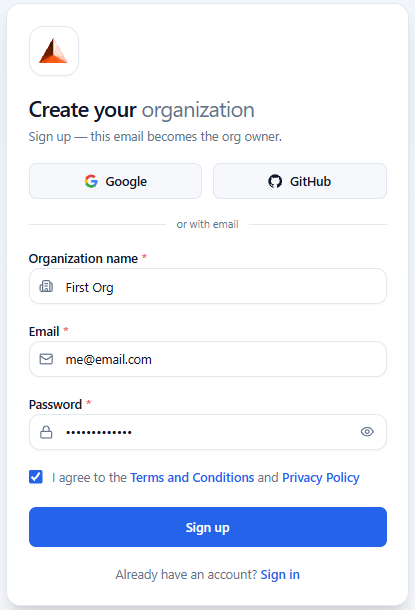
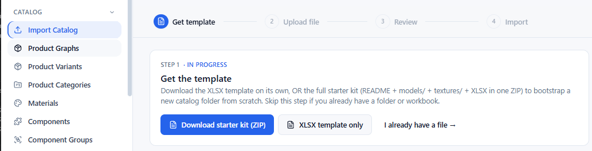
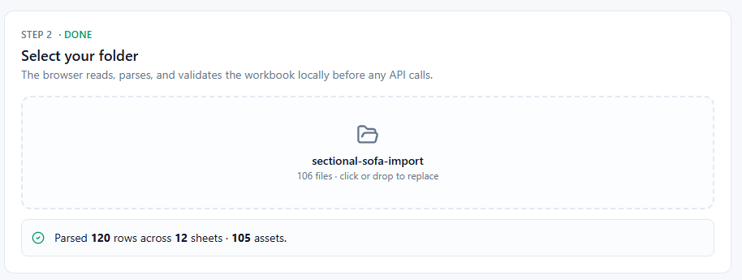
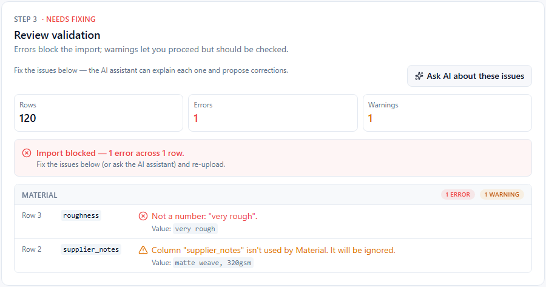
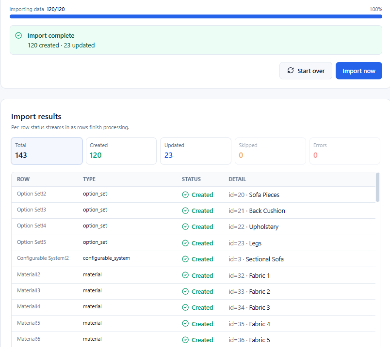
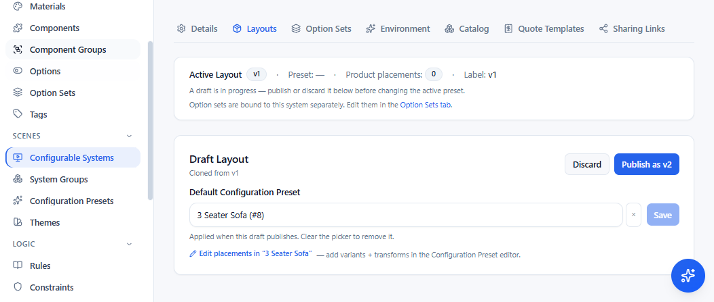
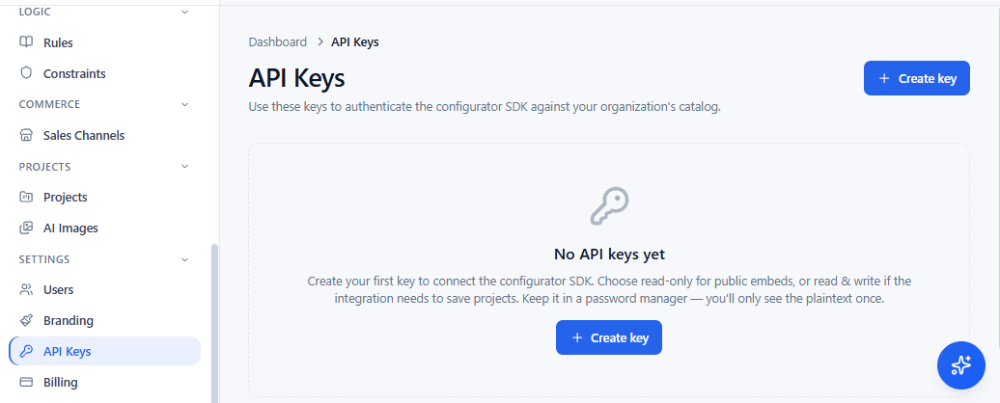
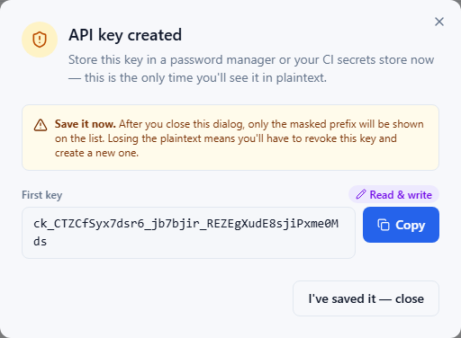

# imagine.io Configurator SDK — Boilerplate

A starter app for the **imagine.io Configurator SDK** — the complete configurator your
customers use: a live 3D scene, options with live pricing, save and share, AR on the phone,
product images and an assistant.

Your products, rules and prices are set up once in the imagine.io admin panel; the SDK
renders them. Install the package, call `mount()` once, and it runs:

```jsx
import { mount, config } from '@imagineio/configurator-sdk';

config.setApiKey(import.meta.env.VITE_API_KEY);
mount('#root', { systemId: Number(import.meta.env.VITE_SYSTEM_ID) });
```

Then change anything about how it looks and behaves — theme, layout, individual components,
your own buttons, modals, 3D renderers and quote templates, or drive the whole thing from
your own page. See [Making it yours](#making-it-yours).

Everything else here gets you to that call: the working app, and the steps from an empty
account to a configurator running on your own data.

📚 Beyond this walkthrough: the **[SDK reference](https://configurator-platform.imagine.io/sdk/index.html)**
(every public function, embedding, the e-commerce bridge) and the
**[admin guide](https://configurator-platform.imagine.io/admin-guide/index.html)**, both at
[configurator-platform.imagine.io](https://configurator-platform.imagine.io/).

> **Licence:** non-commercial use only until you hold a paid subscription, and the sample
> 3D assets are non-commercial **forever**, subscription or not. This repository itself may
> not be passed on as a starter kit or template. See [LICENSE.md](LICENSE.md) and
> [data-samples/LICENSE-ASSETS.md](data-samples/LICENSE-ASSETS.md) before you ship anything.

---

## Quick start

```bash
git clone https://github.com/pnkj1002/imagine-configurator-sdk-boilerplate.git
cd imagine-configurator-sdk-boilerplate
npm install
cp .env.example .env.local      # then paste your API key into it
npm run dev
```

Open http://localhost:5173. If the key is missing the page says so instead of rendering an
empty canvas.


<sub>No key or no system id: you get this, not a blank canvas. First row of the troubleshooting table.</sub>


Four things must be true before anything appears: you have an account, your org has a
catalog, you have an API key, and you know your system id. The rest of this page is those
four things in order.

---

## 1. Sign up

Create an organisation and an owner account at **https://admin-configurator.imagine.io**.
Sign-up takes an organisation name, an email and a password (8 characters minimum); the
first user is the org owner and can invite the rest of the team.

Everything you create below — products,
materials, options, systems — belongs to that org, and an API key only ever sees its own
org's data.



<sub>Sign-up at admin-configurator.imagine.io. The first account becomes the org owner.</sub>


## 2. Build (or import) a catalog

**The configurator renders nothing until your organisation has a catalog.** There is no
built-in demo data: a valid key pointed at an empty org gives you an empty scene.

The fastest path is to import a sample bundle — five steps, a few minutes, and you get a
fully-populated configurator instead of an empty scene.

**1. Download and extract a bundle.** There are two — the **sectional sofa** (22.1 MB) and the
**kitchen** (71.8 MB); either one gets you a working configurator, so pick one and use it for
the rest of this section. The catalogs are hosted, not
committed — the clone stays small and you pull only what you want. Extracting is not
optional: each zip contains a wrapping folder, so `catalog.xlsx` is *not* at the archive root
and the importer cannot read the zip as-is.

```bash
cd data-samples

# Sectional sofa — the Anne modular sofa, 22.1 MB
curl -O https://cnfs.imagine.io/sample-data/sectional-sofa-import.zip
unzip sectional-sofa-import.zip

# …or the kitchen — cabinets, appliances, worktops, 71.8 MB
curl -O https://cnfs.imagine.io/sample-data/kitchen-import.zip
unzip kitchen-import.zip
```

**2. Open the importer.** Admin panel → **Import Catalog** (`/catalog-import`).


<sub>The wizard runs in four steps: get template → upload → review → import.</sub>


**3. Give it the folder, not the zip.** Choose **select folder** and pick the extracted
`sectional-sofa-import` (or `kitchen-import`) folder — or drag it onto the picker. The wizard
finds `catalog.xlsx` and resolves the `models/…`, `textures/…` and `assets/…` paths relative
to it.


<sub>Pick the extracted folder — not the .zip. The wizard reads catalog.xlsx from inside it.</sub>


**4. Import.** Review what the dry run found, then run the import.


<sub>Errors block the import; warnings do not. Fix errors in the workbook and re-upload.</sub>


<sub>When it finishes you get a count of what was created, updated and skipped.</sub>


**5. Publish the layout.** ← *the step everyone misses.* The importer stops at a **draft**,
exactly as the admin UI does, and it does not hand you a link to what it just created —
so find it yourself:

- Sidebar → **Scenes** → **Configurable Systems**
- Open the system the import created (its name comes from `catalog.xlsx`)
- **Layouts** tab → **Publish**


<sub>The step everyone misses. Until the layout is published the configurator loads an empty scene.</sub>


Until you do, the configurator has nothing live to load and mounts into an empty
scene — with no error, because nothing failed.

Then grab the system id from its admin URL (`…/configurable-systems/2` → `2`) for
`VITE_SYSTEM_ID` in step 3 below.

Field-by-field schema notes, the `swaps` column format, and what the flat import *cannot*
express: **[docs/import-sample-catalog.md](docs/import-sample-catalog.md)**.

**Building your own catalog instead?** The admin panel, in this order: materials →
components → product graphs and variants → option sets and options → a configurable system
that ties them together. Publish the layout at the end, exactly as in step 5.

## 3. Create an API key

In the admin panel: **Settings → API Keys → Create key**.



<sub>The only time the full key is shown. After this dialog closes it is masked for ever.</sub>




**Copy it immediately.** The full key is returned only in the response that creates it —
every later read shows it masked as `ck_…abcd` (last four characters), so a key you did not
copy cannot be recovered. Create a replacement and revoke the old one.

**Choose the scope deliberately**, because it is enforced by the platform, not by your code:

| Scope | Key looks like | What it can do |
|---|---|---|
| **Read & write** | `ck_…` | Everything — catalog, pricing, **and saving projects / uploading renders**. Use this one for the boilerplate. |
| Read only | `ck_ro_…` | Catalog, evaluate and pricing only. **Cannot save projects**, and cannot mint a read-write session token. |

The configurator loads and renders fine on a read-only key — the failure only shows up later,
when save/share does nothing. If that is what you are seeing, check the prefix on your key.

**Name the websites that may use it.** A key is scoped to the origins it will be called
from, and **at least one is required**. An empty list is not "any site" — it is *no*
site: the browser's preflight is refused everywhere, so the key works nowhere.

For this boilerplate that means your dev server, **with the port**:

```
localhost:5173
```

| Entry | Matches |
|---|---|
| `localhost:5173` | that dev machine and port |
| `shop.example.com` | that host over http **or** https |
| `https://shop.example.com` | exactly that origin |
| `*.example.com` | any subdomain, and `example.com` itself |

**Bare `localhost` matches port 80 only**, so it will not match the Vite dev server on
5173 — add the port. This is the usual reason a brand-new key fails with a CORS error
on the very first request while looking perfectly valid in the admin panel.

Add your real domains before you deploy, and keep the localhost entry or drop it as you
prefer — the list is editable at any time.


Keys are per-organisation and you can hold several, so give each consumer its own
(storefront, mobile, this boilerplate) and revoke them independently. Scope stays editable
after creation: flipping a leaked key to read-only defangs it without breaking read traffic.

**This route is for local development.** A key in `.env.local` ends up inside the bundle you
deploy; before you go live, move to a server-minted token —
[Going to production](#going-to-production-mint-a-token-never-ship-the-key).

Then put it in `.env.local` (never in source, never in git):

```bash
VITE_API_KEY=ck_your_real_key_here
VITE_SYSTEM_ID=2
```

`VITE_SYSTEM_ID` names **which** configurator loads — find it in the admin panel under
Configurable Systems, in the URL of the system you want (`…/configurable-systems/2` → `2`).
Without it, nothing mounts.

Vite reads env files **at startup only**. Edit `.env.local`, then restart `npm run dev`.

## 4. Mount it

That is all of [src/main.jsx](src/main.jsx):

```jsx
import { mount, config } from '@imagineio/configurator-sdk';

config.setApiKey(import.meta.env.VITE_API_KEY);
const app = mount('#root', { systemId: Number(import.meta.env.VITE_SYSTEM_ID) });
// later: app.unmount();
```

Two things are yours to set: the key and the system id. `mount()` loads the catalog, builds
the scene and renders the full default UI.

---

## Going to production: mint a token, never ship the key

Everything above puts `VITE_API_KEY` in the browser. **Vite inlines that value into the
bundle you deploy**, so anyone who opens devtools can read it — `.env.local` keeps the key
out of git, and that is the only thing it does. Fine for local development or a demo behind
a login; not fine for a public page.

The key is long-lived and reads your whole catalog, so in production it stays on your
server. Your server exchanges it for a **session token**: a 30-minute credential the browser
can safely hold.

```
Browser (SDK)  ──►  your server  ──►  imagine.io      POST /api/v1/auth/token/  (X-Api-Key)
       ◄── token           ◄── { access_token, expires_in, … }
```

**Your server — one route.** The key lives in an env var here and nowhere else, and the
response goes back to the page unchanged:

```js
// server.js — your backend
app.post('/configurator-token', async (req, res) => {
  const r = await fetch('https://api-configurator.imagine.io/api/v1/auth/token/', {
    method: 'POST',
    headers: { 'X-Api-Key': process.env.CONFIGURATOR_API_KEY, 'Content-Type': 'application/json' },
    body: JSON.stringify({ scope: 'session', system_id: 2, origin: 'https://www.your-site.com' }),
  });
  res.status(r.status).json(await r.json());
});
```

All three body fields are optional, and each one narrows what a stolen token is worth:

| Field | What it does |
|---|---|
| `scope` | `session` can save projects and upload renders; `catalog` can only load, configure and price — use it for anonymous pages. A read-only key mints `catalog` tokens only. |
| `system_id` | Locks the token to the one system this page shows. |
| `origin` | Locks it to your site, so a token lifted from your page is useless anywhere else. |

**Your page — hand `mount()` the route as a callback.** This build has no `VITE_API_KEY` at all:

```jsx
const app = mount('#root', {
  systemId: 2,
  getToken: async () => (await fetch('/configurator-token', { method: 'POST' })).json(),
});
```

That is the whole change. The SDK sends the token as `Authorization: Bearer` on every request,
and never the key.

**The token expires, and the SDK refreshes it by calling your route again.** You write no
refresh logic — but the route has to keep working for as long as the page is open:

- **When it re-asks** — at 80% of the token's lifetime (about 24 minutes into a 30-minute
  token), and once more if a request comes back 401, which covers a rotated or revoked key.
- **How the lifetime is read** — `expires_at` if your response carries it (immune to network
  latency), otherwise `expires_in`, otherwise 30 minutes is assumed.
- **Concurrent calls are deduped** — a boot fires catalog, systems and products almost at
  once, and your route is still hit only once.
- **A failed refresh keeps the old token** rather than clearing it, so a blip on your side
  cannot kill a live configurator; the next 401 forces a fresh attempt.

So the route must not be single-use: no one-shot nonce, and if it sits behind a login
session, that session needs to outlive the page. Nothing resembling a refresh token is stored
in the browser — "refreshing" is only your callback being called again.

If the key ever leaks, revoke it in the admin panel: every token minted from it stops working
within about 30 seconds.

**Want no server at all?** Use a shareable link instead. Create one in the admin panel —
**Scenes → Configurable Systems →** open your system **→ Links** — and you get a ready-made
URL that opens the full configurator on its own page. It carries its own credential, so
there is no key and no token to manage: share it directly, put it behind a button, or drop
it in an `<iframe>` on your site. Each link is named, can be switched off on its own, and is
scoped to that one system.

An embedded link can still be driven from the surrounding page — selecting options, reading
the configuration — over `postMessage`. Both are covered in the
[SDK reference](https://configurator-platform.imagine.io/sdk/index.html).

---

## Installing the SDK in your own app

If you would rather start from your own project than this one:

```bash
npm create vite@latest my-configurator -- --template react --yes
cd my-configurator
npm install @imagineio/configurator-sdk react@^18.2 react-dom@^18.2
npm install -D @types/react@^18.3 @types/react-dom@^18.3
```

Three details that are easy to get wrong, and what each one costs you:

- **Always install with `@latest`.** Current builds publish under the `latest` dist-tag
- **Pin React 18.** A fresh Vite template scaffolds React 19, which the SDK's 3D stack does
  not support (`@react-three/fiber@8` needs React 18). Skip the pin and the install dies
  with `ERESOLVE`.
- **Pin the React *types* too**, even in a plain JavaScript project. create-vite scaffolds
  React 19 types; pinning only the runtime leaves them mismatched — no error, just wrong
  autocomplete everywhere.

Then add the Vite plugin, which serves the SDK's static assets and dedupes `three`/`react`
so exactly one copy of each ends up in your bundle:

```js
// vite.config.js
import imagineConfigurator from '@imagineio/configurator-sdk/vite';
export default defineConfig({ plugins: [react(), imagineConfigurator()] });
```

---

## Making it yours

Everything visible is replaceable through a registry: you register a replacement, the SDK
renders yours instead of its own. None of it needs an SDK release.

**[Customise the UI](https://configurator-platform.imagine.io/sdk/index.html#customize)** is
the section to read first — theme tokens, plain-CSS styling, component overrides, slots,
layouts, the quote PDF and the ~50 components in `parts.*`.

Then **[Guides](https://configurator-platform.imagine.io/sdk/index.html#guides)** takes each
one end to end, with runnable code:

| Guide | What it covers |
|---|---|
| [Customize Theme & Layout](https://configurator-platform.imagine.io/sdk/index.html#howto-theme-layout) | Full-screen scene, one token, a whole new theme, your own shell and option panel |
| [Override Button Functionality](https://configurator-platform.imagine.io/sdk/index.html#howto-buttons) | Add to or replace what the built-in buttons do |
| [Add a Custom Button](https://configurator-platform.imagine.io/sdk/index.html#howto-custom-button) | Your own button, wired to the scene or to your own UI |
| [Add Custom 3D Functionality](https://configurator-platform.imagine.io/sdk/index.html#howto-3d) | Move objects, load and animate your own |
| [Customize or Create Quote Templates](https://configurator-platform.imagine.io/sdk/index.html#howto-quote) | Modify the shipped template, or build your own |
| [Integrate with E-Commerce Platforms](https://configurator-platform.imagine.io/sdk/index.html#howto-ecom) | Drive options from your store, keep the cart in sync |
| [Add Custom Popups](https://configurator-platform.imagine.io/sdk/index.html#howto-popup) | Your own modal, opened by a button or by a rule |
| [Integrate Custom APIs](https://configurator-platform.imagine.io/sdk/index.html#howto-api) | Send entries out, gate the engine on your API, pull data at boot |
| [Work with Custom Rules and Constraints](https://configurator-platform.imagine.io/sdk/index.html#howto-rules) | Where rules and constraints live, and writing one of each |
| [Work with Placement Logic](https://configurator-platform.imagine.io/sdk/index.html#howto-placement) | Modular runs, grids, wall layouts and their anchors |
| [Customize the Loading Screen](https://configurator-platform.imagine.io/sdk/index.html#howto-loader) | Restyle ours, or replace it |
| [Adding Custom Dimension Code](https://configurator-platform.imagine.io/sdk/index.html#howto-dims) | Imperial units, your own display, dimensions outside the canvas |

Every public function, with signatures and worked examples:
**[API reference](https://configurator-platform.imagine.io/sdk/index.html#fullref)**.

## Sample catalogs

Two complete catalogs, **hosted rather than committed**, so cloning this repo does not drag
94 MB of models behind it:

| Bundle | Download | Size | Catalog | Assets |
|---|---|---|---|---|
| **Sectional sofa** — the Anne modular sofa | [sectional-sofa-import.zip](https://cnfs.imagine.io/sample-data/sectional-sofa-import.zip) | 22.1 MB | 33 components, 12 variants, 4 option sets, 33 options, 12 materials, 3 presets, 5 constraints, 1 rule | 37 GLB, 24 textures, 37 thumbnails |
| **Kitchen** — cabinets, appliances, worktops | [kitchen-import.zip](https://cnfs.imagine.io/sample-data/kitchen-import.zip) | 71.8 MB | 325 components, 75 variants, 15 option sets, 129 options, 15 materials, 4 presets, 76 rules, 20 constraints, 641 anchor points | 631 GLB, 98 SVG, 51 textures, 2 HDRI |

Download into `data-samples/` (both the zips and the extracted folders are gitignored), then
drop the **extracted folder** on the importer — the wrapping folder inside means the zip
itself cannot be uploaded.

Full walkthrough: [docs/import-sample-catalog.md](docs/import-sample-catalog.md).

## Requirements

Node ≥ 18, React 18, Vite. Peer deps (`three` 0.159, `@react-three/fiber` 8,
`@react-three/drei` 9) are installed automatically by npm 7+.

**Strict CSP?** Theme fonts load at runtime from Google rather than from the package —
`https://fonts.googleapis.com` in `style-src` and `https://fonts.gstatic.com` in
`font-src` — and only when a theme names a Google font.

Models, textures and generated images are fetched from imagine.io asset hosts, so
`connect-src` and `img-src` have to permit those too — ask us for the exact hosts for your
environment.

## Troubleshooting

| Symptom | Cause |
|---|---|
| Blank page, "Setup needed" | `VITE_API_KEY` or `VITE_SYSTEM_ID` missing from `.env.local` — or you edited it without restarting the dev server |
| 401 on every request | Wrong or revoked API key |
| CORS error, or "Failed to fetch", on the very first call | This site's origin is not on the key's allowed list — add it, and include the port for `localhost` (step 3) |
| "This configurator isn't available right now", console names a missing system | `VITE_SYSTEM_ID` points at a system this organisation does not have — check the id in the admin URL, and that the key belongs to the same org |
| Loads fine, but save/share does nothing | Read-only key (`ck_ro_…`) — create a read & write key |
| Empty scene, no errors | Valid key, but the org has no catalog, or `systemId` names a system whose layout was never published |
| Imported the sample, still empty | The layout is still a draft — publish it from the system's **Layouts** tab |
| Importer can't find `catalog.xlsx` | You uploaded the zip instead of the extracted folder |
| `ERESOLVE` on install | React 19 in the project — pin React 18 (see above) |
| SDK behaves like an older build | You installed without `@latest`
| Blank canvas, `three` `instanceof` errors | Two copies of `three` — add the `imagineConfigurator()` Vite plugin |
| Your API key is visible in the deployed JS | Expected — `VITE_` values are inlined at build. Switch to a server-minted token ([Going to production](#going-to-production-mint-a-token-never-ship-the-key)) |
| `getToken` route answers, but requests still 401 | The token was minted for a different `origin` or `system_id` than the page is using |
| Token auth works, but save/share does nothing | Minted with `scope: 'catalog'` — use `scope: 'session'`, from a read & write key |

More: **[docs/troubleshooting.md](docs/troubleshooting.md)**.

## Licence

Non-commercial until you hold a paid subscription — [LICENSE.md](LICENSE.md). Sample assets
stay non-commercial permanently, and may not be modified —
[data-samples/LICENSE-ASSETS.md](data-samples/LICENSE-ASSETS.md).

**Do not pass the boilerplate on.** Build configurators with this code, and deliver a
configurator you built to the client you built it for. You may not republish, resell or
redistribute this repository, or a modified copy of it, as a starter kit, template or
development tool.
